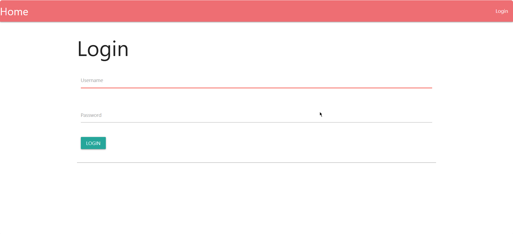
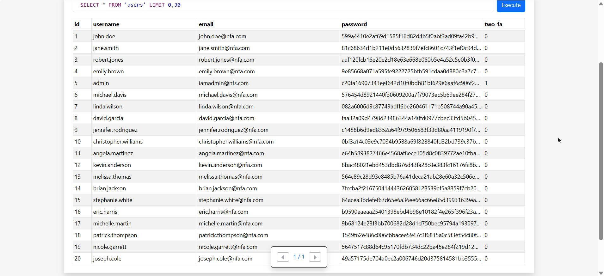
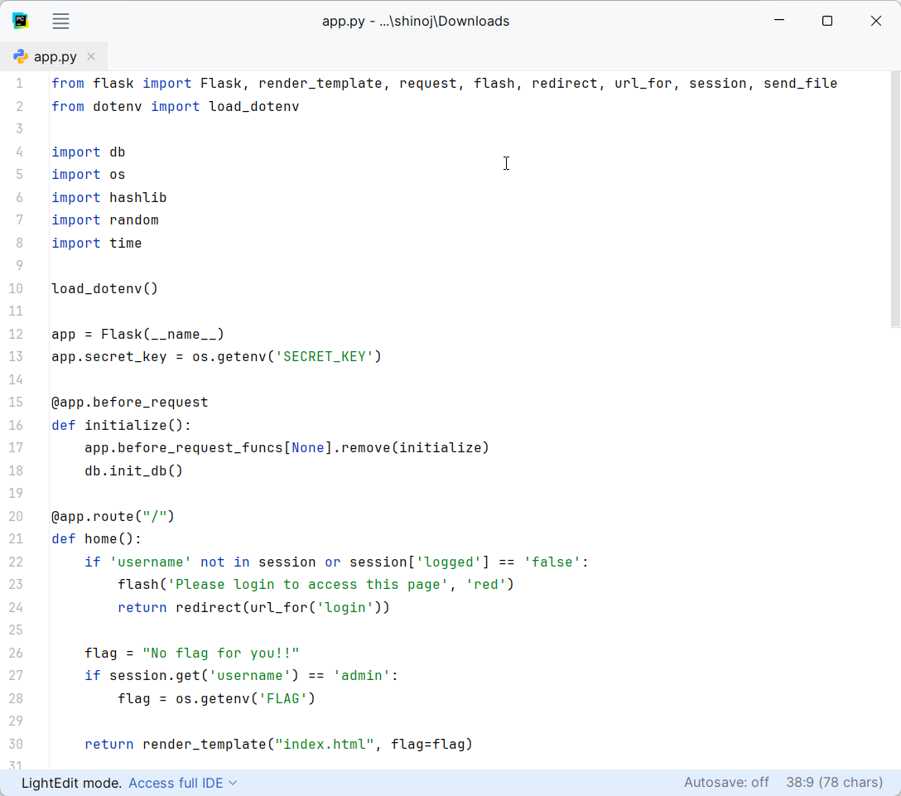
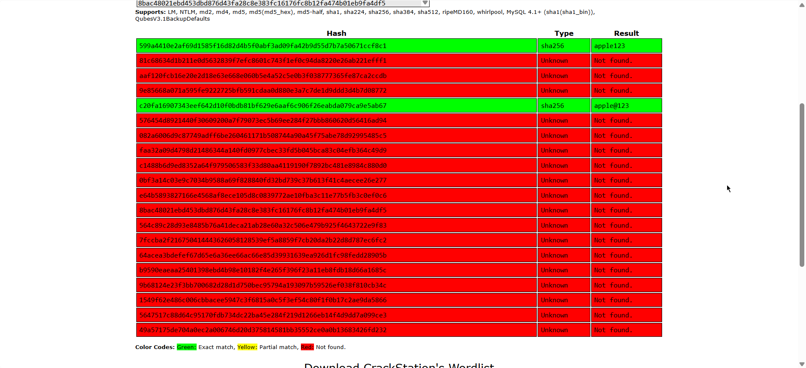
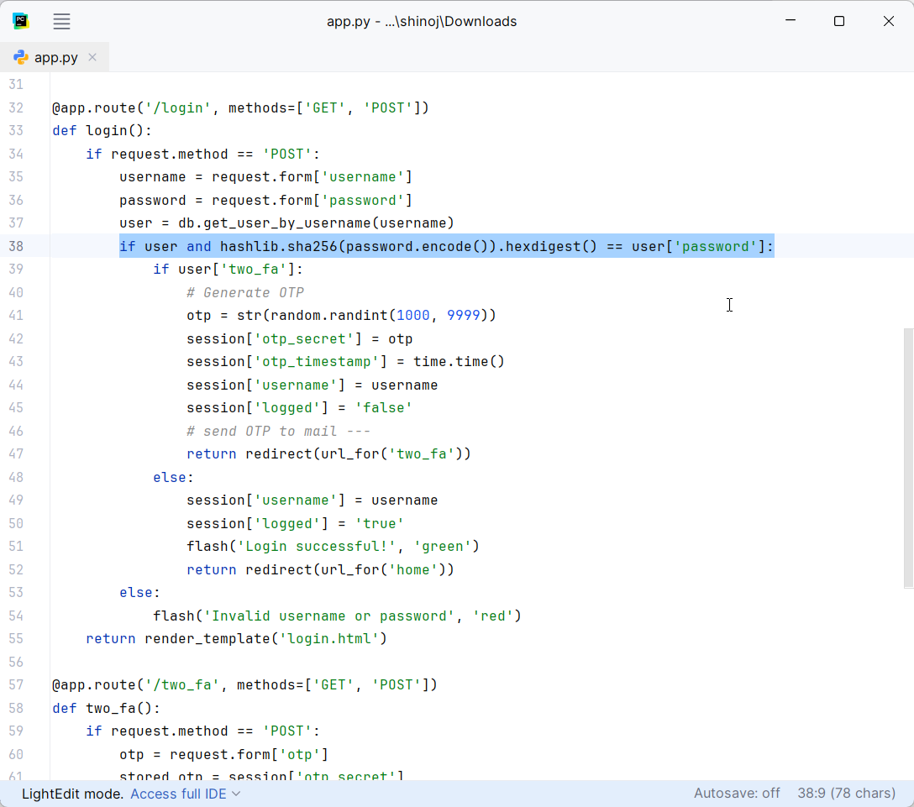
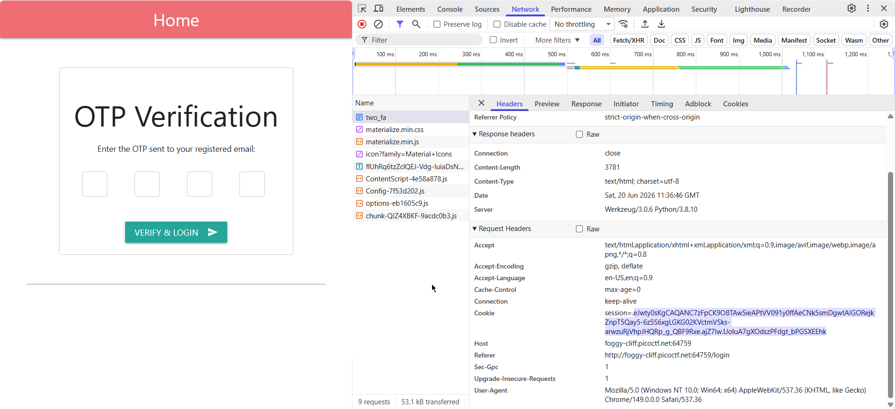
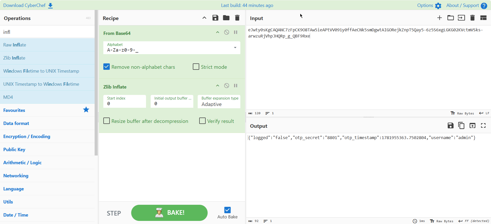
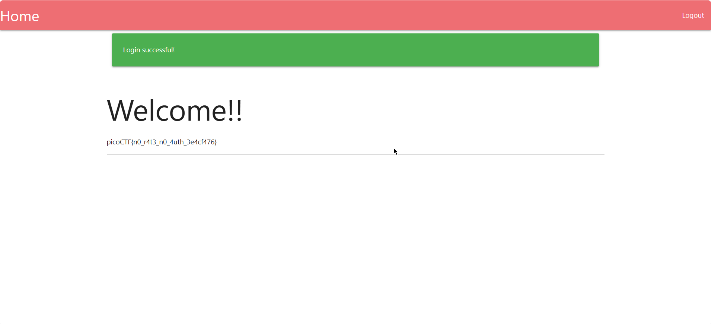

# No FA

**Category:** Web
**Difficulty:** Medium
**Date solved:** 19-06-2026

---

## Challenge Description

> Seems like some data has been leaked! Can you get the flag?

---

## What I Did (Recon)

The challenge provided me with a link of a login page, an application code file and a database file.

- I opened the link and went through the login page.
- It was a simple login form with username and password fields.
- Form cannot be submitted without any values.

  

- I checked the source code of the page using "View page source" in the browser.
- Nothing out of the ordinary, so I proceeded with checking the database file.
- I used an [online database viewer](https://inloop.github.io/sqlite-viewer/) to view the file.
- It had records of 20 users containing id, username, email, password and two_fa.
  
  

- Then I proceeded to go through the application code file. 

---

## Finding the Bug / Clue

- The application code showed that the login page was a flask application. It had the page's login and 2fa logic. 
- From the login function of the application I learned that it was hashing the user passwords using SHA256. 

  
  
- So I decided to crack the hash using [Crackstation](https://crackstation.net/), I gave it all the hashed passwords from the database file. 
- After cracking, I got the password of users "john.doe" and "admin".
  
  

- I logged in using the admin's login credentials and got greeted with 2FA page. 
- So again went through application file to find a workaround. 
 
  
  
- There I found that the OTP was being hardcoded into the user's session id. 
- I decided to exploit this.

---

## Exploiting It (Step by Step)

1. I opened Network tab in the browser's Dev Tools.
   
     

2. There I found a session cookie `eJwty0sKgCAQANC7zFpCK9O8TAw5ieAPtVV091y0ffAeCNk5smDgwtAIGORejkZnpT5Qay5-6z5S6xgLGKG02KVctmVSks-arwzuRjVhpJHQRp_g_QBF9Rxe.ajZ7Iw.UoluA7gXOdszPFdgt_bPGSXEEhk`
3. From the looks of it, the cookie seemed to be obfuscated using some kind of encoding, so I took help of [Claude](https://claude.ai) to find which encoding was used.  
4. Claude told me that it was Flask session cookie, it has 3 segments and this is the format used by Flask session cookies: `<payload>.<timestamp>.<signature>` and that it was encoded in Base64.
5. I understood that I need to decode the payload, so got instructions from Claude on how to decode it in [CyberChef](https://gchq.github.io/CyberChef/).
6. Following the instructions got me JSON data containing the OTP.
   
     


7. Which I then used to complete the 2FA and received the flag.

      

---

## Flag

```
picoCTF{n0_r4t3_n0_4uth_3e4cf476}
```

---

## What I Learned

The password was only hashed and stored on the database, which isn't a good practice. 
The 2FA was being done on the client side and exposed the OTP via session cookie. 
To avoid all this a server side session token would've been better.

---
